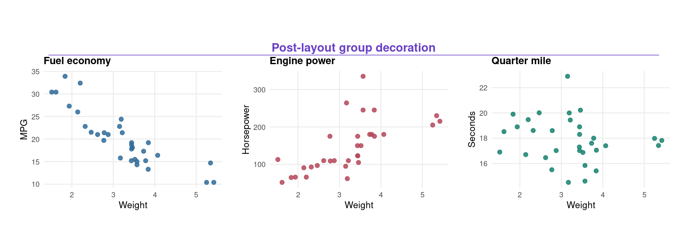
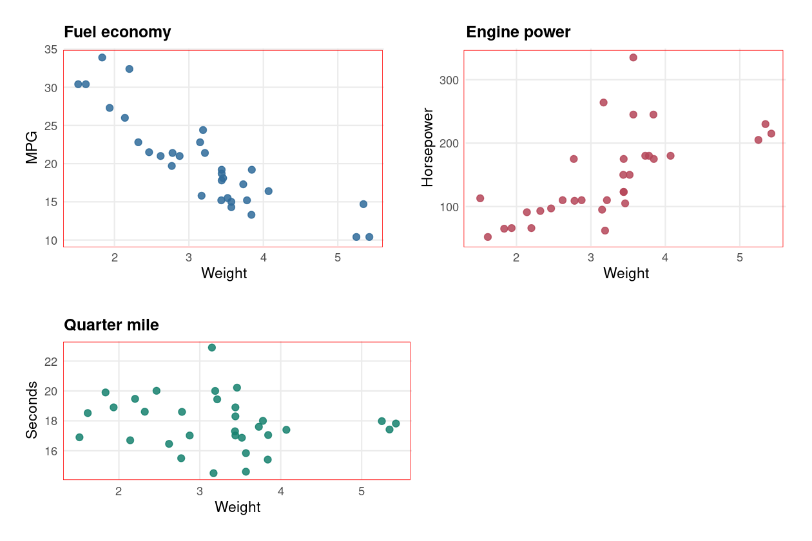
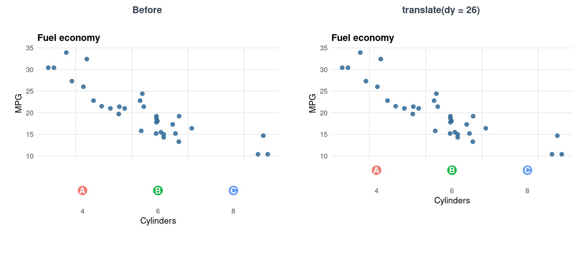
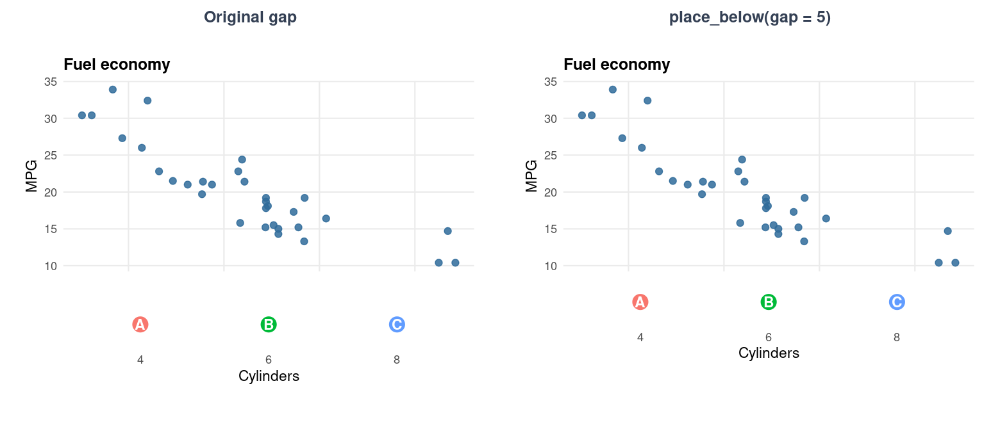
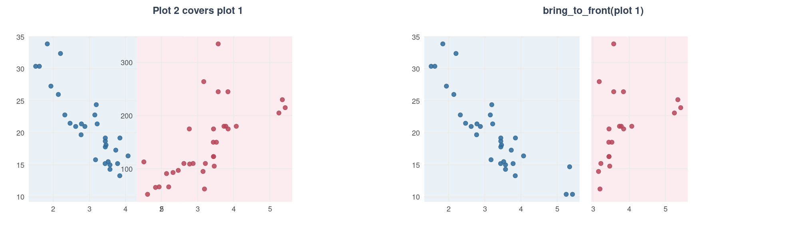
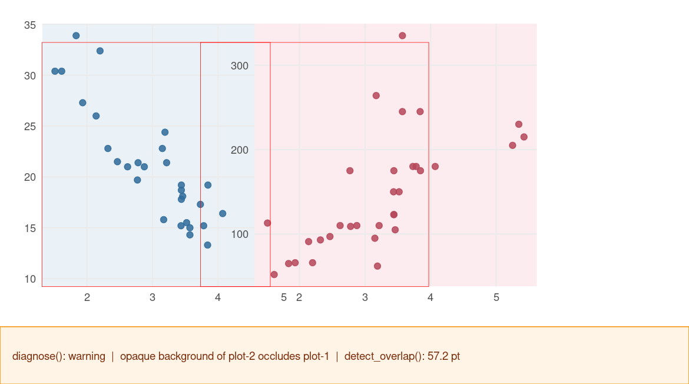
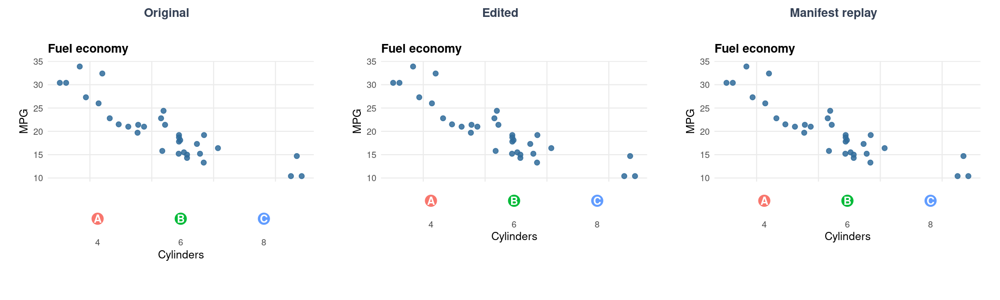
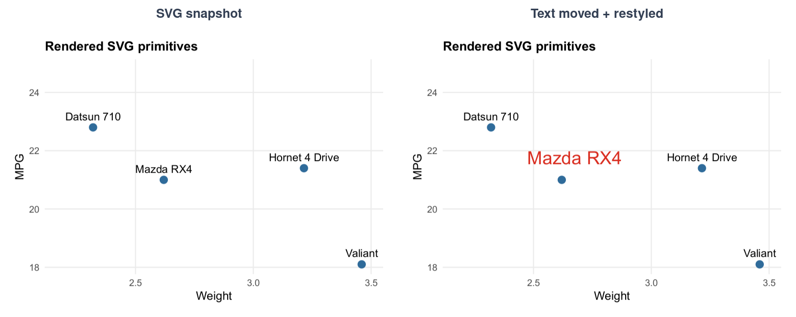
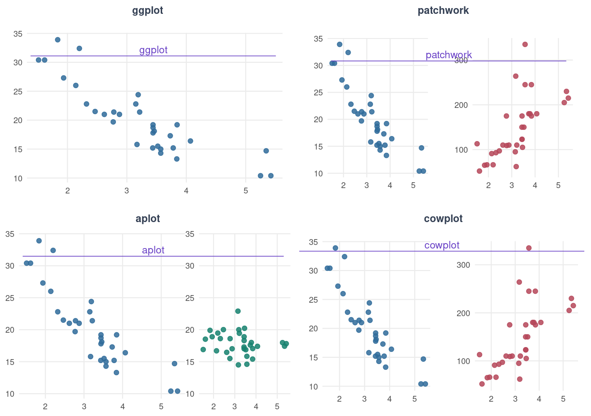

# Incantation

**Agent native 的图形布局和后处理方案**

[](https://www.r-project.org/)
[](DESCRIPTION)
[](LICENSE)

[快速开始](#30-秒上手) · [功能](#功能) · [后端](#后端) · [API 速查](#api-速查)

<br clear="right">



Incantation 面向论文制图的最后一公里：图已经基本正确，只需要把某个子图上移一点、
让两块 panel 严格对齐、补一条跨图标题线，或检查改动是否越界。它包含两层：

- `inc_scene`：编辑完成布局后的 plot、panel、标题、坐标轴和装饰元素。
- `inc_svg`：直接编辑最终 SVG 中的文字、点、线和路径。

支持 ggplot2、patchwork、aplot、cowplot 和 raw gtable。

## 安装

```r
# 开发版本
pak::pak("Vinnish-A/Incantation")
```

## 30 秒上手

```r
library(incantation)
library(ggplot2)
library(patchwork)

p1 = ggplot(mtcars, aes(wt, mpg)) + geom_point()
p2 = ggplot(mtcars, aes(wt, hp)) + geom_point()
p = p1 / p2

scene = incant(p, width = 7, height = 6)

edited = scene |>
  select_plot(2) |>
  translate(dy = 18, unit = "pt")

bbox(edited, 2)
diagnose(edited)
ggsave_incant(edited, "edited.svg")
```

`width` 和 `height` 是必填项。所有测量都绑定到明确的输出设备，避免同一个 pt 位移
在不同画布上产生不可预测的结果。

## 功能

### 1. 检查和测量布局

`incant()` 先让原绘图后端完成布局，再建立稳定的元素 registry。
`inspect()`、`bbox()` 和 `gap()` 返回可直接用于判断和自动化的设备坐标。



```r
scene = incant(p, width = 8, height = 6)

inspect(scene)                 # 全部可寻址元素及 bbox
bbox(scene, 1)                # plot 1 的 panel 边界，单位 pt
gap(scene, 2, 1)              # 两个 panel 的有符号间距
canvas_size(scene)            # 固定画布大小
render(scene, debug = TRUE)   # 红框显示 plot panel
```

辅助函数：`plot_label()` 可核对子图序号，`is_empty_element()` 可识别 spacer。

### 2. 选择并平移元素

选择器只接受明确的 plot 序号、语义角色或稳定 ID；空选择和歧义选择都会报错。
`translate()` 只改变最终绘制位置，不重新计算 patchwork 行高、列宽或兄弟图位置。



```r
edited = scene |>
  select_plot(2) |>
  translate(dy = 26, unit = "pt", clip = "off")
```

可用选择器：

```r
select_plot(scene, 2)
select_panel(scene, 2)
select_role(scene, "title", plot = 1)
select_id(scene, "plot-2/axis-l")
selection_spec(select_plot(scene, 2))
```

### 3. 声明间距和对齐关系

如果希望编辑在不同设备尺寸上仍保持同样的物理间距，使用语义约束，而不是记录一次性
位移。约束会在渲染或 manifest 重放时根据当前几何重新求解。



```r
edited = scene |>
  place_below(2, 1, gap = 5, unit = "pt")

edited = scene |>
  align_top(2, 1) |>
  align_left(2, 1)
```

同组函数：`place_above()`、`align_top()`、`align_bottom()`、`align_left()`、
`align_right()`。

### 4. 调整绘制层级

重叠并不一定是错误，但目标必须处在正确的 z-order。层级调整仍然不会改变布局占位。



```r
overlapped = incant(p1 + p2, width = 7, height = 4) |>
  select_plot(2) |>
  translate(dx = -105, include_background = TRUE)

front = overlapped |>
  select_plot(1) |>
  bring_to_front()

back = overlapped |>
  select_plot(2) |>
  send_to_back()
```

### 5. 添加跨子图标题和装饰线

`decorate_group()` 根据目标 panel 的最终几何生成线条和标题，支持四个方向、两端独立
trim、标题对齐和绝对/语义 span。


```r
p3 = ggplot(mtcars, aes(wt, qsec)) + geom_point()

decorated = incant(p1 + p2 + p3, width = 11, height = 4) |>
  decorate_group(
    plots = 1:3,
    title = "Post-layout group decoration",
    side = "top",
    trim = c(6, 10),
    gap = 3,
    id = "group-a"
  )
```

装饰整体、线和标题都是一等元素，可以继续编辑：

```r
decorated |>
  select_id("group-a/title") |>
  translate(dx = 4, dy = -1)
```

### 6. 诊断越界、遮挡和重叠

`diagnose()` 返回机器可读的 `status` 与 `issues`；`detect_overlap()` 返回重叠对象、
方向和重叠量。它们适合放进视觉 Agent 的“检查—编辑—复核”闭环。



```r
diagnose(overlapped)
# $status
# [1] "warning"

detect_overlap(overlapped)
#         a      b overlap_pt       axis
# 1  plot-1 plot-2       44.1 horizontal
```

### 7. 保存和重放结构化操作

Scene 保存的是操作，不是不可审计的临时 grob。语义约束会在新 scene 上重新测量，
因此编辑代码和原始绘图代码可以分开维护。



```r
write_incantation(edited, "edit.json")

fresh = incant(p, width = 7, height = 6)
replayed = apply_incantation(fresh, "edit.json")

as_manifest(replayed)
```

### 8. 编辑最终 SVG 图元

`as_svg()` 把最终渲染结果冻结为 `inc_svg`。之后的选择和编辑只依赖 SVG，不需要访问
ggplot layer 或原始数据。



```r
svg = scene |>
  as_svg()

edited_svg = svg |>
  select_svg_text("Mazda RX4") |>
  svg_translate(dx = 12, dy = 8) |>
  svg_style(fill = "#D92D20", font_size = 17)

verify_svg(svg, edited_svg)
write_svg(edited_svg, "edited.svg")
```

SVG 选择器：`select_svg_id()`、`select_svg_text()`、`select_svg_at()`、
`select_svg_bbox()`。

SVG 变换：`svg_translate()`、`svg_scale()`、`svg_rotate()`、`svg_style()`、
`svg_hide()`、`svg_zorder()`。`svg_manifest()` 可检查所有最终图元。

### 9. 渲染和保存

```r
as_gtable(scene)                         # 返回编辑后的 gtable
render(scene, debug = TRUE)              # 可绘制 gtable，可显示 debug 边界
draw(scene)                              # 绘制到当前设备
ggsave_incant(scene, "figure.png")       # png / pdf / svg
```

`ggsave_incant()` 会拒绝与 scene 不一致的输出尺寸。这样不会把在 7 × 6 inch 画布上
调好的绝对位移静默应用到另一尺寸。

## 后端

同一套选择、测量、变换、装饰和 manifest API 用于所有后端。



| 输入 | 行为 |
|---|---|
| ggplot | 作为一个可编辑 plot |
| patchwork | 支持普通、嵌套、facet 和 inset 组合 |
| aplot | 保留用户视角的主图/插图序号，不暴露内部 spacer |
| cowplot | 从 `GeomDrawGrob` viewport 恢复每个子图 |
| raw gtable | 按结构识别 ggplot、cowplot 或 patchwork 风格 |

Cowplot 没有独立的子图布局 cell，因此装饰的 `layout_outer` 使用子图 viewport 外边界。
已经转换为 raw gtable 的 aplot 不再含有恢复用户序号所需的 `$layout`；这类情况应把
原始 aplot 对象传给 `incant()`。

## 核心约束

- **Frozen Layout**：编辑不改变画布、panel 尺寸、布局 tracks 或兄弟图位置。
- **设备绑定**：`translate()` 和绝对 span 绑定 scene 尺寸；语义约束可跨尺寸重算。
- **固定画布**：装饰空间不足时由 `diagnose()` 报告，不自动扩画布。
- **显式选择**：找不到目标、目标为空或选择有歧义时立即报错。
- **SVG 快照身份**：SVG manifest 绑定 `source_hash`，不承诺跨不同快照匹配同一图元。

## API 速查

| 模块 | 函数 |
|---|---|
| Scene | `incant()` |
| 检查 | `inspect()`、`bbox()`、`gap()`、`canvas_size()`、`plot_label()`、`is_empty_element()` |
| 选择 | `select_plot()`、`select_panel()`、`select_role()`、`select_id()`、`selection_spec()` |
| 变换 | `translate()`、`place_below()`、`place_above()`、`align_*()` |
| 层级 | `bring_to_front()`、`send_to_back()` |
| 装饰 | `decorate_group()` |
| 诊断 | `diagnose()`、`detect_overlap()` |
| 渲染 | `as_gtable()`、`render()`、`draw()`、`ggsave_incant()` |
| 操作记录 | `as_manifest()`、`write_incantation()`、`apply_incantation()` |
| SVG | `as_svg()`、`svg_manifest()`、`select_svg_*()`、`svg_*()`、`verify_svg()`、`write_svg()` |

## 开发验证

```r
devtools::test()
devtools::check()
```

README 中的功能效果图均由 [dev/readme-figures.R](dev/readme-figures.R) 使用当前包代码生成，
不是手工示意图。
